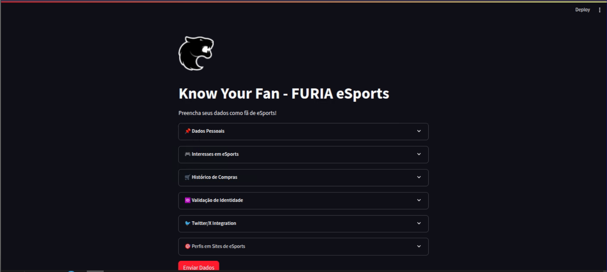
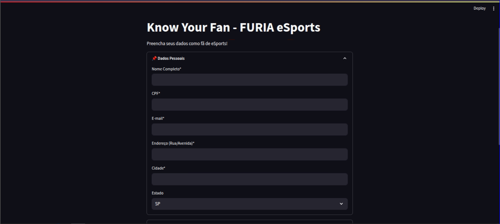
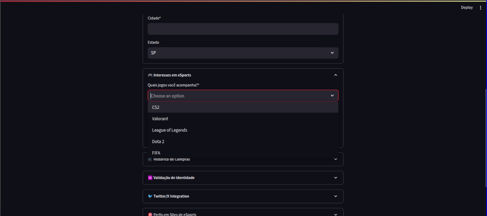
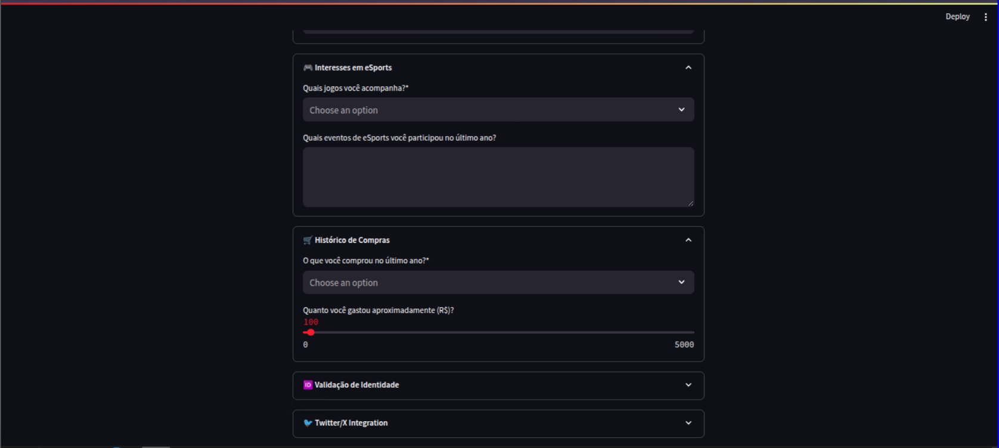
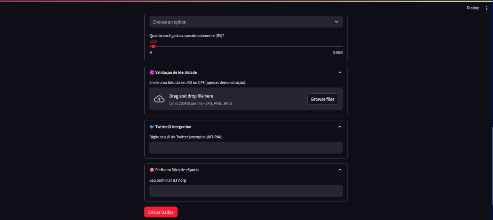

# Know Your Fan - FURIA eSports 🎮

Aplicação web para cadastro e análise de fãs da FURIA eSports, integrando dados pessoais, interesses em eSports, histórico de compras e validação de identidade.


## 📌 Visão Geral

Este projeto é um formulário inteligente para cadastro de fãs da FURIA eSports que:
- Coleta dados pessoais e preferências de jogos
- Valida documentos de identidade via OCR
- Integra com redes sociais (Twitter/X)
- Analisa perfis em plataformas de eSports (HLTV)
- Armazena dados no Supabase

## 🛠️ Tecnologias Utilizadas

- **Frontend**: Streamlit
- **Backend**: Python
- **Banco de Dados**: Supabase (PostgreSQL)
- **APIs**: 
  - Twitter API (via Tweepy)
  - OpenAI API (para análise de texto)
- **Processamento de Imagem**: 
  - Tesseract OCR (para extração de texto de documentos)
  - Hugging Face Transformers (para análise de perfis)

## ⚙️ Configuração do Ambiente

### Pré-requisitos

- Python 3.8+
- Tesseract OCR instalado no sistema ([Guia de instalação](https://github.com/tesseract-ocr/tesseract))
- Contas de desenvolvedor nas APIs utilizadas

### Instalação

1. Clone o repositório:
   ```bash
   git clone https://github.com/seu-usuario/know-your-fan-furia.git
   cd know-your-fan-furia

2. Crie e ative um ambiente virtual:
    ```
        # Know Your Fan - FURIA eSports 🎮

Aplicação web para cadastro e análise de fãs da FURIA eSports, integrando dados pessoais, interesses em eSports, histórico de compras e validação de identidade.


## 📌 Visão Geral

Este projeto é um formulário inteligente para cadastro de fãs da FURIA eSports que:
- Coleta dados pessoais e preferências de jogos
- Valida documentos de identidade via OCR
- Integra com redes sociais (Twitter/X)
- Analisa perfis em plataformas de eSports (HLTV)
- Armazena dados no Supabase




## 🛠️ Tecnologias Utilizadas

- **Frontend**: Streamlit
- **Backend**: Python
- **Banco de Dados**: Supabase (PostgreSQL)
- **APIs**: 
  - Twitter API (via Tweepy)
  - OpenAI API (para análise de texto)
- **Processamento de Imagem**: 
  - Tesseract OCR (para extração de texto de documentos)
  - Hugging Face Transformers (para análise de perfis)

## ⚙️ Configuração do Ambiente

### Pré-requisitos

- Python 3.8+
- Tesseract OCR instalado no sistema ([Guia de instalação](https://github.com/tesseract-ocr/tesseract))
- Contas de desenvolvedor nas APIs utilizadas

### Instalação

1. Clone o repositório:
   ```
    git clone https://github.com/seu-usuario/know-your-fan-furia.git
    cd know-your-fan-furia
   ```

2. Crie e ative um ambiente virtual
   ```
    python -m venv venv
    source venv/bin/activate  # Linux/Mac
    venv\Scripts\activate     # Windows
   ```

3. Instale as dependências:
   ```
    pip install -r requirements.txt
   ```

4. Configure as variáveis de ambiente:

    - Crie um arquivo .env na raiz do projeto com:
    ```
        TWITTER_API_KEY=seu_api_key
        TWITTER_API_SECRET=seu_api_secret
        SUPABASE_URL=seu_supabase_url
        SUPABASE_KEY=seu_supabase_key
        OPENAI_API_KEY=sua_chave_openai
    ```
## 🚀 Executando a Aplicação
Execute o servidor Streamlit com:
   ```
    streamlit run app.py
   ```

    A aplicação estará disponível em http://localhost:8501

## 🧩 Estrutura do Código

- Validação de CPF: Algoritmo que verifica a validade do CPF digitado

- Processamento de Imagens:

    - Extração de texto de documentos com Tesseract OCR

    - Validação de tipo de documento (RG/CPF)

- Integração com Twitter:

    - Vinculação de perfil via @username

    - Simulação de interações com a FURIA

- Análise de Perfil HLTV:

    - Sistema de pontuação de afinidade com a FURIA

    - Geração automática de insights

- Armazenamento no Supabase:

    - Inserção de dados estruturados na tabela fans


## 📋 Funcionalidades Principais
1. Formulário de Cadastro

    - Dados pessoais com validação

    

    - Preferências de jogos e eventos

    

    - Histórico de compras e gastos

    

2. Validação de Identidade

    - Upload de documentos (RG/CPF)

    - Extração e verificação de dados via OCR

    - Comparação com informações digitadas
    
    

3. Integração Social

    - Conexão com perfil do Twitter

    - Análise simulada de interações

    - Vinculação de perfil HLTV.org

4. Armazenamento Seguro

    - Persistência em banco de dados Supabase

    - Estrutura de dados normalizada

## 📊 Banco de Dados
A aplicação utiliza uma tabela fans no Supabase com a seguinte estrutura:

```
    Coluna	Tipo	Descrição
    nome	text	Nome completo do fã
    cpf	text	CPF (único)
    email	text	E-mail de contato
    endereco	text	Endereço residencial
    cidade	text	Cidade de residência
    estado	text	UF (SP, RJ, MG, etc)
    jogos	text[]	Lista de jogos de interesse
    eventos	text	Eventos participados
    compras	text[]	Itens comprados
    valor_gasto	integer	Estimativa de gastos
    twitter_user	text	Perfil no Twitter
    hltv_profile	text	Perfil na HLTV
    created_at	timestamp	Data de criação do registro
```

## 🤝 Contribuição
Contribuições são bem-vindas! Siga os passos:

    1. Faça um fork do projeto

    2. Crie uma branch (git checkout -b feature/nova-feature)

    3. Commit suas mudanças (git commit -m 'Adiciona nova feature')

    4. Push para a branch (git push origin feature/nova-feature)

    5. Abra um Pull Request
